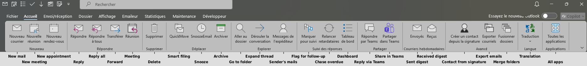
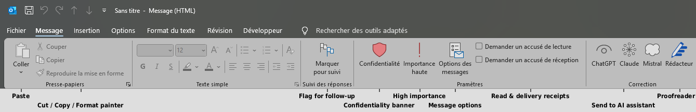
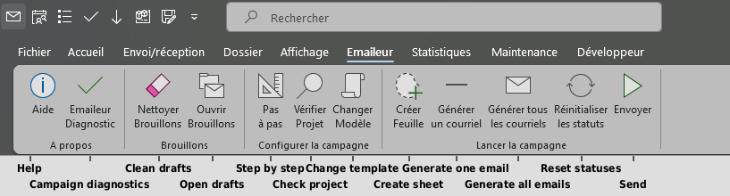
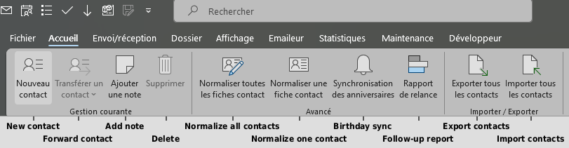
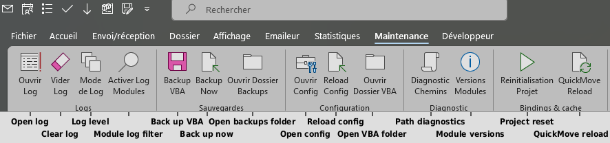

# ClassicOutlook-Toolkit

A productivity automation suite for **Outlook Classic (desktop)**, written entirely in
VBA, plus a standalone **Excel email-analytics** tool. It grew out of daily
knowledge-work needs: filing mail in two keystrokes, tagging appointments by project,
filing replies automatically, colouring meetings by attendee type, running small mail
campaigns, tracking which sent mails are still awaiting a reply, keeping the address
book clean, and more.

Everything runs inside a single Outlook VBA project (`ThisOutlookSession`, four
`WithEvents` classes and about 56 standard modules, roughly 41,000 lines), with all
business configuration externalized to a `config.ini` file. The UI is **bilingual**
(French / English), switchable from one config key.

Version 3 (September 2026) is a full code review: multi-mailbox reply filing,
asynchronous campaigns, a self-healing folder index, shared infrastructure modules and
an extended source validator. See `RELEASE-NOTES-v3.md` and `CHANGELOG.txt`.

Project pages, with screenshots and a feature tour written for users: in English
https://alexandre-gambuto.com/classicoutlook-toolkit-en/, en français https://alexandre-gambuto.com/classicoutlook-toolkit/.



## Highlights

- **Zero-install, locked-down friendly.** No admin rights, no installer, no registered
  COM, no `Tools > References` entries. Late binding everywhere; registry writes limited
  to `HKCU`; no shell or PowerShell spawned. Designed to survive a managed M365 tenant
  with an EDR agent.
- **No UserForms in the Outlook project.** The VBA Project Object Model is assumed
  blocked, so all interaction goes through ribbon-pinned macros, `MsgBox` / `InputBox`
  and small toast notifications. (The separate Excel tool does use UserForms.)
- **64-bit clean.** Every `Declare` uses `PtrSafe` and `LongPtr`.
- **Config-driven.** Project codes, patterns, colours, paths, thresholds, vocabulary and
  feature toggles live in `config.ini`, loaded once at startup into typed globals.
- **Centralized logging** with four levels (`ERROR/INFO/DEBUG/TRACE`) and per-module
  filtering.
- **Bilingual UI.** `Language=FR` or `Language=EN`; every user-facing string goes through
  a `T(fr, en)` helper. Logs and functional strings stay as they are.
- **Validated sources.** `validate.py` checks every file before it is pasted into the
  VBE: declaration order, balance, encoding, accent markers, duplicate declarations,
  cross-module references, config keys.
- **Guided first run.** With no `config.ini`, a quick start guide offers, a few seconds
  after startup, to check the environment, ask five questions and write a minimal
  configuration file. Re-run it any time from *Maintenance > Configuration*.

---

## Screenshots

| | |
|---|---|
|  |  |
|  |  |

The time-tracking sheet (`docs/images/dashboard-time-tracking.png`) is shown in `docs/FEATURES.md`.

## Documentation

| Document | Content |
|----------|---------|
| `docs/FEATURES.md` | Feature tour by theme, written for users. |
| `docs/INSTALL.md` | Step-by-step installation and upgrade guide. |
| `docs/CONFIGURATION.md` | `config.ini` key reference. |
| `docs/TROUBLESHOOTING.md` | Known pitfalls of Outlook VBA in a locked-down environment. |
| `ARCHITECTURE.md` | Module topology, startup flow, event routing, conventions. |
| `CONTRIBUTING.md` | Coding conventions and delivery rules. |
| `RELEASE-NOTES-v3.md` | What changed in version 3. |
| `CHANGELOG.txt` | Full change history, newest first. |

---

## What's inside

### Orchestration

| File | Role |
|------|------|
| `ThisOutlookSession` | Single entry point: `Application_Startup`, global Outlook events, ribbon shims. |
| `clsAppEvents` | Central `WithEvents` listener on `Application.Inspectors` and the mail Explorer; routes events to the right modules. |
| `clsApptWatcher` | Per-appointment watcher (anti-overlap, colouring, Teams block cleanup). |
| `clsExplorerWatcher` | Keeps one Explorer window pinned to the mail role and one to the calendar role (dual-monitor setup). |
| `clsInboxWatcher` | Watches the Inbox of one mailbox for new-mail alerts. |

### Configuration and infrastructure

| Module | Role |
|--------|------|
| `modConfig` | Loads `config.ini` into typed globals; getters, the `T()` bilingual helper and the `A()` accent decoder. |
| `modDebugLog` | 4-level logger with per-module filtering and a rotating log file. |
| `modDefer` | Central deferred-action scheduler (`SetTimer` based): the only reliable way to run "in N seconds" code in this Outlook session. |
| `modCommon` | Shared stateless helpers (file-name sanitizing, HTML escaping, folder resolution, safe property access, Excel liveness test). |
| `modUi` | Single entry point for dialogs: foreground guarantees, topmost, a toast when an input box is waiting behind another window. |
| `modMsgBoxCustom` | `MsgBox` with renamed buttons and an auto-close countdown that pauses while Outlook is in the background. |
| `modNotify` | Non-blocking, auto-closing toast notifications (multi-monitor aware). |
| `modSmtp` | SMTP resolution (current user, recipients, organizer, sender), internal-domain test, session cache. |
| `modExcelBridge` | Shared Excel COM lifecycle: ghost instance detection, stealth open with retry, block reads, safe save and close. |
| `modInspectorQueue` | Keeps Inspector objects alive between `NewInspector` and a deferred pass. |
| `modStoreContext` | Default store and mailbox context helpers. |
| `modDevTools` | Dev helpers, including hot-reload (`Reinit`) without restarting Outlook. |
| `modMaintenance` | Maintenance menu: logs, backups, config reload, bindings check, module versions, caches. |
| `modQuickStart` | First-run quick start guide: environment check, five questions, minimal `config.ini`. |
| `modBackupVBA` / `modBackupAuto` | Manual and monthly automated backup of the VBA environment, caches and registry settings (exported in pure VBA). |

### Mail

| Module | Role |
|--------|------|
| `modQuickMove` | Fast filing into the folder trees of all mailboxes: code detection, folder search, recent history, self-healing index. |
| `modReplyInPlace` | Files sent replies and forwards into the folder of the parent message, in any mailbox. |
| `modReplyGreeting` | Inserts a personalised greeting line at the top of single-recipient replies. |
| `modProjectTag` | Project, contract and opportunity tagging; creates referential entries on the fly. |
| `modMigrateTags` | One-shot migration of legacy tag properties. |
| `modMailCampaign` | Mail-merge campaigns from an Excel sheet, asynchronous throttled send, per-row status, stop command. |
| `modMailConfidentiality` | Cyclic confidentiality and urgency banner, subject prefix, sensitivity sync. |
| `modMailResponseTracker` | Tracks sent mail awaiting a reply, with an Excel dashboard and reminders. |
| `modReplySuspicion` | Post-send scoring to detect mails likely awaiting a reply (configurable vocabulary). |
| `modInboxAlert` | Per-mailbox new-mail alerts with grouping, sound and colour. |
| `modHideBcc` | Hides the Bcc field on every new compose window. |
| `modSnooze` | Postpones selected mails to a chosen date and time. |
| `modSearch` | Quick "received / sent this week" searches. |
| `modMailExport` | Batch export of selected mails to PDF. |
| `modMarkAllRead` | Marks every unread mail of the current mailbox as read. |
| `modFolderScan` | Auto-archives inactive project subfolders at startup. |
| `modFolderMerge` / `modFolderSort` / `modFolderRename` | Merge two folders, reset the manual folder order, mass-rename project folders after a CSV review. |
| `modPurgeCategories` | Removes categories from non-recurring appointments. |
| `modSendToLLM` | Sends the selected mail body to a browser-based writing assistant. |

### Calendar

| Module | Role |
|--------|------|
| `modMeetingColor` | Auto-colours meetings by attendee nature (internal, external, commercial). |
| `modAntiOverlap` | Shifts a short appointment that collides with an existing one. |
| `modNewMeetingDefault` | Default duration for new appointments. |
| `modMeetingToAppointment` | Turns a meeting with no third-party invitee back into a plain appointment and removes the Teams block. |
| `modAppointmentPrivacy` | Sets appointments of configured organizers to private. |
| `modShiftAppointment` / `modFlashAppointment` | Shift an appointment by 15 minutes; create a quick "flash" slot. |
| `modMaximizeWindow` | Opens new inspector windows maximized. |

### Contacts

| Module | Role |
|--------|------|
| `modContactFromMail` | Creates a contact card from the signature of the selected mail. |
| `modContactBirthday` | Yearly birthday and name-day events synchronised with contact cards. |
| `modContactNormalize` | Harmonises cards across all contact folders (names, phones, addresses, duplicates). |
| `modContactRelation` | "Cooling relationships" report from sent items. |
| `modContactNote` | Dated journal entries at the top of a contact card. |
| `modContactExport` / `modContactImport` | CSV export and re-import of every contact folder, photos included. |
| `modContactCommon` | Stateless helpers shared by the contact modules. |

### Other

| Module | Role |
|--------|------|
| `modOneNote` | OneNote notebook inventory and reorganization (requires a working OneNote COM registration). |
| `modOneNoteProbe` | Standalone diagnostic probe for the OneNote COM chain. |

### Excel email-analytics (separate project)

`modMailAnalytics` (plus its `frmConfig` / `frmProgress` UserForms) is a self-contained
Excel/VBA tool that scans Outlook mailboxes and builds a multi-sheet statistics report:
volumes, sent and received, internal and external, To versus Cc share, weekday and hour
distributions, monthly and yearly evolution, heatmaps, top contacts, response times. It
supports incremental updates. It has its own README.

### Ribbon

The `*.exportedUI` files are exported Outlook ribbon customizations that bind the
buttons to the public macros. Import them via *File > Options > Customize Ribbon >
Import/Export*.

---

## Requirements

- **Outlook Classic** (desktop). Not New Outlook, not Outlook on the web.
- **64-bit Office** (the `Declare` statements assume it).
- Windows, with the usual scripting hosts available (`WScript.Shell`, `Scripting`,
  `MSXML`), all used through late binding.
- For the Excel tool and the referential workbooks: Excel with VBA.
- Python 3 (optional) to run `validate.py` before pasting.

---

## Installation (short version)

Because the VBA Project Object Model is assumed blocked, modules are pasted in by hand.

1. `Alt+F11` to open the VBA editor in Outlook.
2. Paste the infrastructure modules first (`modConfig`, `modDebugLog`, `modCommon`,
   `modUi`, `modDefer`, `modSmtp`, `modExcelBridge`, `modContactCommon`,
   `modInspectorQueue`, `modNotify`, `modMsgBoxCustom`, `modStoreContext`), then the
   others. Class modules (`clsAppEvents`, `clsApptWatcher`, `clsInboxWatcher`,
   `clsExplorerWatcher`) go into class modules; `ThisOutlookSession` into the existing
   object of that name.
3. Copy `config.ini.example` to `config.ini`, edit it for your environment.
   `python validate.py --config config.ini` lists keys unknown to the code.
4. *Debug > Compile*, close the VBE, restart Outlook.
5. Import the `*.exportedUI` ribbon files if you want the buttons.

The full procedure, including upgrades from earlier versions, is in `docs/INSTALL.md`.

---

## Configuration

All business constants live in `config.ini`; see `docs/CONFIGURATION.md` and the
commented `config.ini.example`. `config.ini` itself is **gitignored** (it contains
environment-specific values); only `config.ini.example` is tracked.

---

## Repository layout

```
*.txt                      Outlook VBA modules / classes (paste into the VBE)
modMailAnalytics*          Excel email-analytics project (+ its own README)
Suivi_des_mails__Feuille_Suivi.txt   VBA of the mail-tracking workbook sheet
*.exportedUI               Outlook ribbon customizations
config.ini.example         Commented configuration template
validate.py                Source validator and generators
*-template.xlsm            Empty copies of the two companion workbooks (sample rows only)
docs/                      Features, installation, configuration, troubleshooting
LICENSE                    GNU General Public License v3.0
ARCHITECTURE.md            Module topology, event routing, conventions
CONTRIBUTING.md            Conventions for contributors
RELEASE-NOTES-v3.md        Version 3 summary
CHANGELOG.txt              Change history
```

---

## License

Copyright (C) 2026 Alexandre Gambuto.

This program is free software: you can redistribute it and/or modify it under the terms
of the **GNU General Public License version 3** as published by the Free Software
Foundation. See [`LICENSE`](LICENSE) for the full text.

It is distributed in the hope that it will be useful, but **WITHOUT ANY WARRANTY**,
without even the implied warranty of MERCHANTABILITY or FITNESS FOR A PARTICULAR
PURPOSE.

In practice: use it, study it, change it, share it. If you distribute a modified version,
or a product that builds on it, that work has to be released under the GPL as well. For a
use that this does not fit, ask the author about a separate commercial licence.
