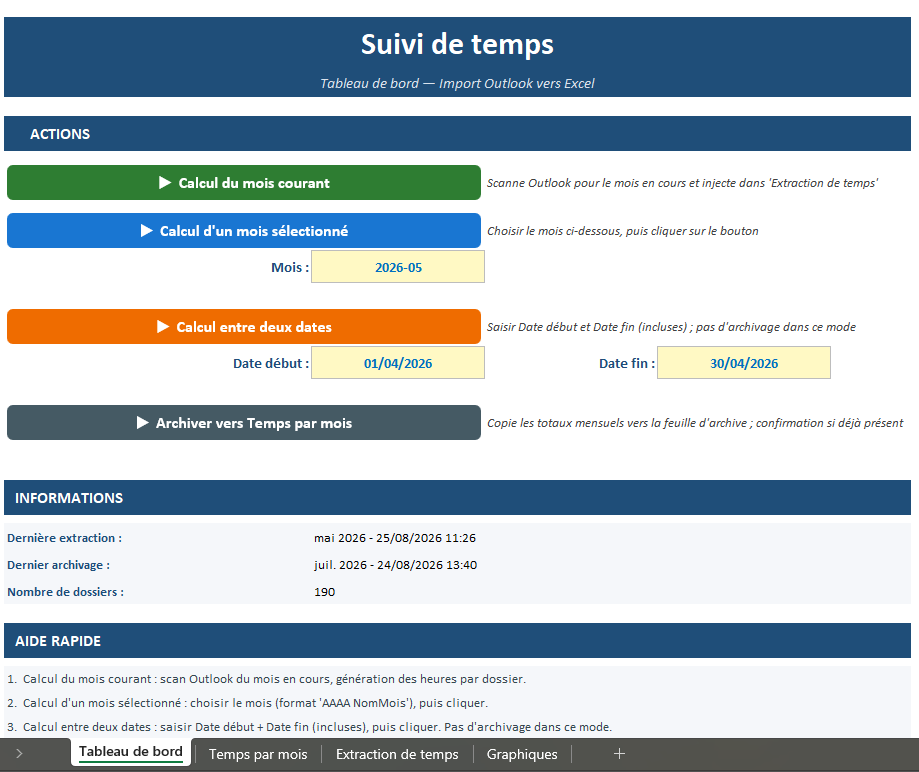

# Feature tour

What the toolkit does, by theme, from the user's point of view. Module names are given
in brackets for readers who want to look at the code. Everything below runs inside
Outlook Classic with no installation.

## 1. Filing mail

**QuickMove** (`modQuickMove`). The heart of the suite. When a mail is sent, or on
demand from the ribbon, the mail is read, a project or contract code is detected in the
subject, the attachment names or the body, and the matching folder is proposed. Typing
one or two characters refines the choice. All mailboxes are indexed; the index is cached
and rebinds by folder identity at startup, so a renamed or moved folder is still found.
If the target folder does not exist, it can be created on the spot, pre-filled from the
project referential. A "go to folder" command navigates anywhere in the tree by keyword.

**Reply in place** (`modReplyInPlace`). A reply or forward sent from a filed mail joins
the folder of the original, in the same mailbox or in a shared one. Nothing lingers in
Sent Items.

**Greeting line** (`modReplyGreeting`). A reply to a single recipient starts with a
personalised greeting. The first name comes from the company directory, or from the
address as a fallback. No repetition if the person was already written to today.

**Folder tools**. Inactive project subfolders are archived automatically at startup
(`modFolderScan`); duplicate folders can be merged (`modFolderMerge`); the manual
ordering of subfolders can be reset (`modFolderSort`); project folders can be renamed in
bulk after a CSV review (`modFolderRename`); orphan categories purged
(`modPurgeCategories`); a whole mailbox marked as read (`modMarkAllRead`); selected mails
exported to PDF (`modMailExport`).

## 2. Calendar and meetings

**Project tagging** (`modProjectTag`). Every appointment the user creates is offered a
project attachment; the subject is then prefixed with the project code and name. Tagged
appointments feed an Excel time-tracking workbook, so hours become traceable project by
project. New referential entries can be created from an appointment.

**Meeting colouring** (`modMeetingColor`). Meetings are coloured by nature: internal,
external, commercial. The week's distribution is visible at a glance.

**Anti-overlap** (`modAntiOverlap`). A short appointment that collides with an existing
one is shifted automatically.

**Personal slots** (`modMeetingToAppointment`, `clsApptWatcher`). A meeting saved with
no third-party invitee is turned back into a plain appointment, the Teams block is
removed from the body, and a toast confirms it. Appointments organised by configured
people are set to private (`modAppointmentPrivacy`).

**Comfort**. Default duration of 15 minutes (`modNewMeetingDefault`), one-click "flash"
appointment (`modFlashAppointment`), shift by plus or minus 15 minutes
(`modShiftAppointment`), inspector windows opened maximized (`modMaximizeWindow`), and
two Explorer windows with fixed roles, one for mail and one for the calendar
(`clsExplorerWatcher`), ideal on two screens.

## 3. Follow-up and reminders

**Response tracker** (`modMailResponseTracker`). Important sent mails are recorded in
an Excel dashboard: who replied, who did not, since when. Replies are detected and
ticked automatically; overdue lines stand out, with follow-up buttons in the workbook.

**Awaiting-reply detection** (`modReplySuspicion`). After each send, the content is
scored: if it looks like a mail that expects an answer, tracking is offered. The trigger
vocabulary is configurable.

**Snooze** (`modSnooze`). A mail that cannot be handled now is put to sleep and comes
back to the Inbox at the chosen date.

**Toasts** (`modNotify`). Confirmations appear as small notifications that close by
themselves, without stealing focus or interrupting typing.

## 4. Campaigns and confidentiality

**Mail campaigns** (`modMailCampaign`). From an Excel sheet (recipients, subject,
message, attachments): personalised drafts, throttled sending in batches, per-row
status, manual sends of a draft detected. Since version 3 the send runs in the
background: Outlook stays usable and a stop command interrupts the series cleanly.

**Confidentiality banners** (`modMailConfidentiality`). A shortcut cycles the level of
the mail being written (confidential, personal, urgent): coloured banner in the body,
prefix in the subject, Outlook sensitivity synchronised.

**Hidden Bcc** (`modHideBcc`). The Bcc field is hidden on every new message.

**Writing assistant bridge** (`modSendToLLM`). The body of the selected mail is sent in
one click to a browser-based assistant to help draft a reply.

## 5. Contacts

**Card from a signature** (`modContactFromMail`). The signature block of the selected
mail is parsed and a pre-filled contact card is proposed: name, title, organisation,
phones, address. Existing cards are detected to avoid duplicates.

**Birthdays** (`modContactBirthday`). A birthday and name-day calendar synchronised with
the cards, with reminders.

**Normalisation** (`modContactNormalize`). Cleans every card: name casing, phone
formats, addresses, duplicates.

**Cooling relationships** (`modContactRelation`). A report of the contacts not written
to for a while, built from sent items.

**Journal** (`modContactNote`). A dated note added at the top of a card in one click.

**Export and import** (`modContactExport`, `modContactImport`). Full backup and
re-import of the address book in CSV, photos included.

## 6. Inbox

**Per-mailbox alerts** (`modInboxAlert`, `clsInboxWatcher`). A notification per mailbox
when mail arrives, with its own sound and colour, grouped during bursts, silent when
Outlook is already in the foreground.

**Quick searches** (`modSearch`). "Received this week", "sent this week", in one button.

**Flag cleanup**. Forgotten technical flags are purged every month.

## 7. Email analytics (standalone Excel tool)

`modMailAnalytics` scans every mailbox and builds a full statistics report: volumes,
sent versus received, internal versus external, To versus Cc share, weekday and hour
distribution, monthly and yearly evolution, top contacts, response times. Incremental
updates avoid rescanning everything.

## 8. Under the hood

- **Central configuration** (`modConfig`): everything specific to an environment lives
  in `config.ini`; the code stays generic.
- **Diagnostic log** (`modDebugLog`): one shared log with four levels of detail.
- **Reliable deferred actions** (`modDefer`): Outlook cannot run "in ten seconds" code
  reliably; a small scheduler does it.
- **Custom dialogs** (`modMsgBoxCustom`, `modUi`): renamed buttons, auto-close
  countdown, foreground guarantees, without any UserForm.
- **Excel without surprises** (`modExcelBridge`): stealth workbook opening, ghost
  instance detection, saves that never persist a hidden window.
- **Automatic backups** (`modBackupAuto`): the whole VBA project and its settings,
  monthly, timestamped.
- **Maintenance menu** (`modMaintenance`): diagnostics, logs, backups, module versions,
  caches.
- **Source validator** (`validate.py`): catches before pasting the mistakes that stop
  Outlook from compiling.
